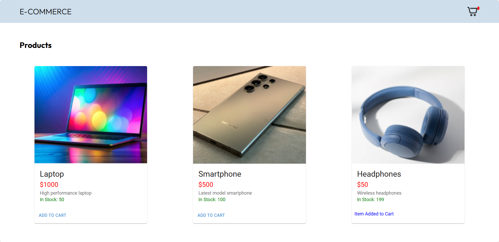
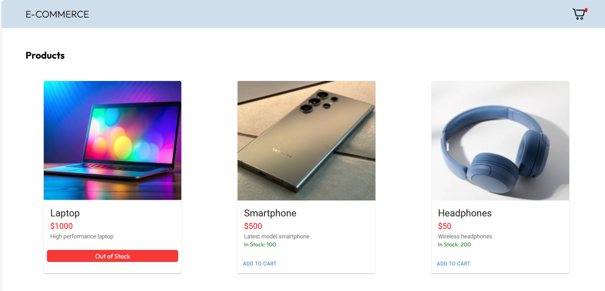
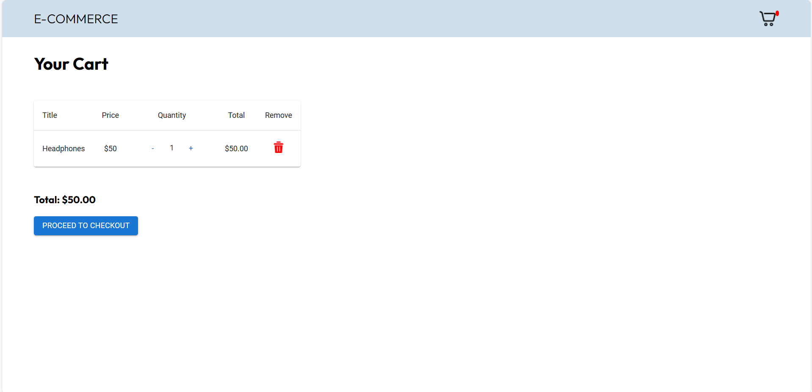
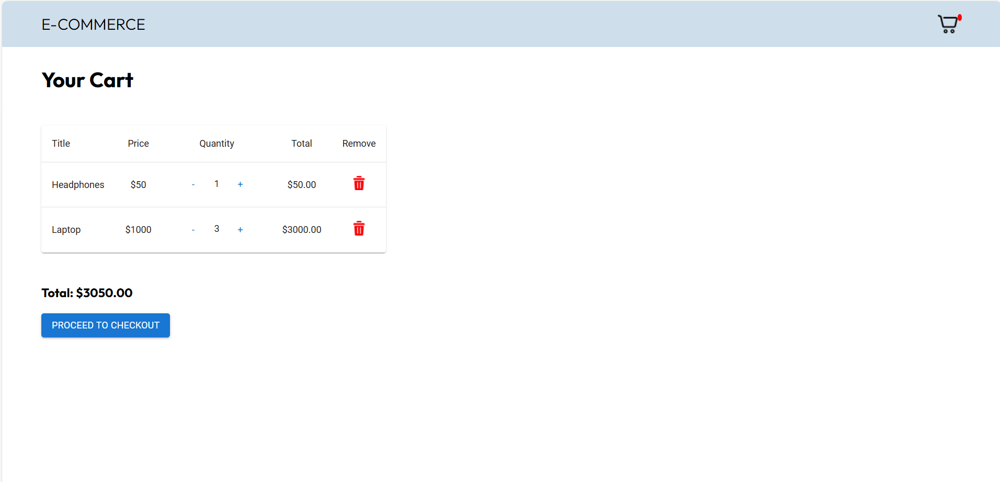
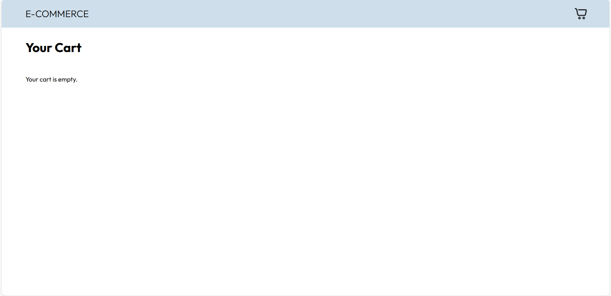
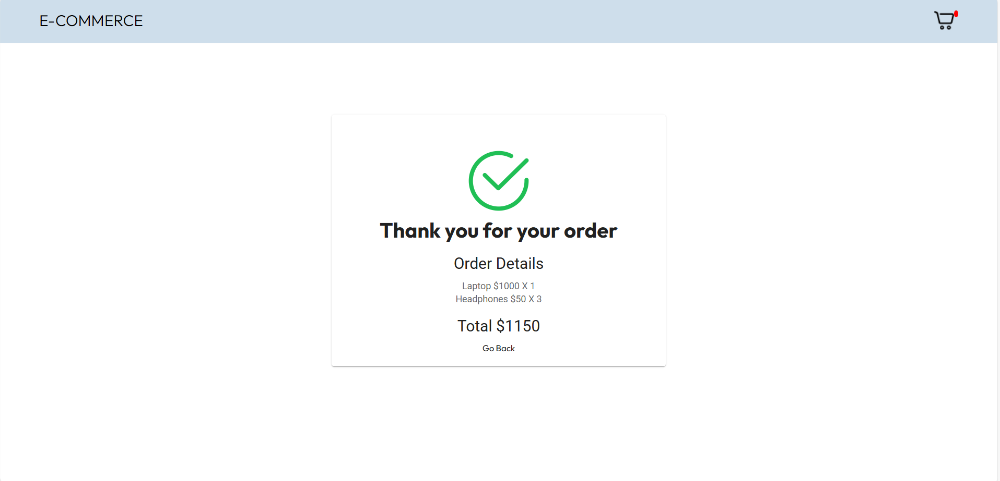

# Project Name:  `E-commerce Product and Cart Management System`

# Description:
`This is a React e-commerce frontend application that allows users to browse products, add them to a cart, and potentially proceed to checkout.`

# Dependencies:

@mui/material: Material UI library for React components

@reduxjs/toolkit: Redux Toolkit for state management

axios: For making HTTP requests

react "^18.2.0" : React library 

react-dom: For rendering React components in the DOM

react-hot-toast: For displaying toast notifications

react-redux: For connecting React components to Redux store

react-router-dom: For routing between different application views

jest: For Unit Testing

# Scripts:

 start: `Starts the development server`

 build: `Builds the production-ready application`

 test: `Runs unit tests`

# Development Setup:

`Extract the ZIP file to a directory of your choice.`

 npm install or yarn install `Install the dependencies`

 npm start `Start the development server. This will typically launch the application at http://localhost:3000/ in your browser.`

 CORS configuration:

`Ensure that the backend has CORS enabled to allow the frontend to communicate with it. In the backend Program.cs add the following`

builder.Services.AddCors(options =>
{
    options.AddPolicy("AllowFrontend", policy =>
        policy.WithOrigins("http://localhost:3000")
              .AllowAnyMethod()
              .AllowAnyHeader());
});

app.UseCors("AllowFrontend");

# Folder Structure:

 src: `Contains the source code of the application. You'll likely find components, Redux slices, API calls, and styling files here.`

 public: `Contains static assets like images, fonts, or favicons.`

 package.json: `Defines project metadata, dependencies, and scripts.`

# Additional Information

In the ProductList component, images for each product are dynamically rendered based on the product's name. The images are selected using the renderProductImage function, which returns a specific image based on the name of the product.

# Project Screenshots:

`Landing Page`

`Product List`

`Cart Page`

`Confirmation Page`

